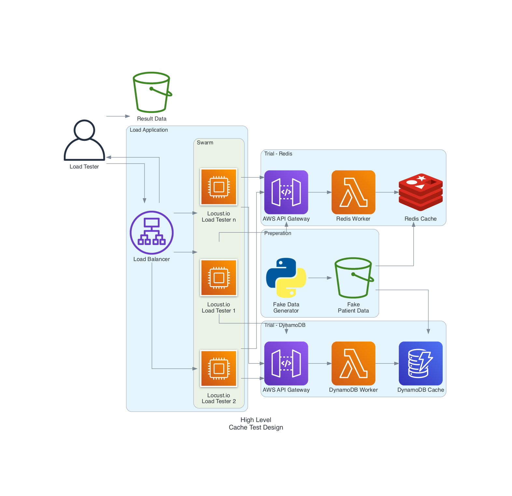

# Cloud Cache Load Test

## Problem Statement

In a simulated but realistically complex environment a serverless app deployed should return cache hit results with low latency and consistent performance.

## Design

### Considerations

- Without enough variation, all services keep data in RAM yielding false (best case) performance.
- With enough data, it forces read-from-block actions which are more indicative of production traffic.
- Assume that all serverless compute functions must be bound to a VPC private network due to regulatory requirements and ensure that ElasticCache/Redis is not at an unfair disadvantage in worker scale out
- Assume that AWS VPC Endpoints are leveraged within the VPC due to regulatory requirements and ensure that DynamoDB is not at an unfair disadvantage due to unpredictable internet latency when routed via an internet gateway or NAT appliance (Gateway or Instance).
- Assume that the load testing software wil directly call the API Gateway to simulate actual user load.
- Assume the API Gateway is called via an AWS VPC Endpoint within the VPC to remove variation introduced by unpredictable internet latency.

### Methods

1. Build a random data generator to create realistic but fake patient records with a microservice size payload for the patient themselves; if applicable, their legal guardian, and their preferred pharmacy. The [fake data application](https://github.com/MyHealthCo/fake-data) will generate this data set.
1. Coming soon!

## Errata and Extensions

This experiment may likely have opportunities to extend and gather better results. Please open an issue and help make this experiment better!
